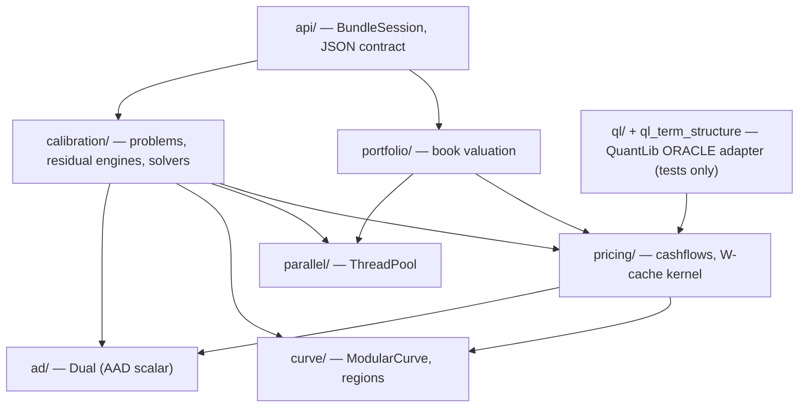
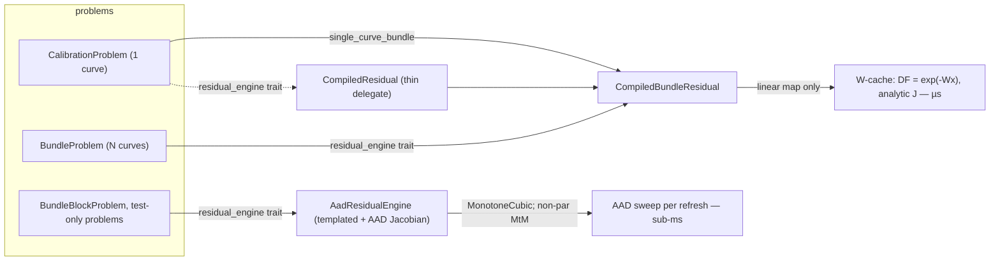

# SwapEngine — code graph

A readable map of the object model for anyone (human or agent) picking the engine up cold. It is the
**map**; `CLAUDE.md` is the **law** (invariants, conventions, phase history).

> **Keep this current.** Any change to the object model — add/remove/rename a type, move a file between
> layers, change a layer dependency, or split/merge a responsibility — updates this file *in the same
> commit*. A stale map is worse than none. (See the rule in `CLAUDE.md`.)
> Last verified against the tree at commit: run `git log -1 --format=%h -- ARCHITECTURE.md`.

## Layers (compile-time dependency DAG)

Every arrow is "depends on / includes". It is acyclic — lower layers never see higher ones. This is what
lets the calibration layer reuse the pricing kernel while the pricing kernel stays QuantLib-free and
standalone.

## What lives in each layer

| Layer | Key types | Role |
|-------|-----------|------|
| `ad/` | `Dual` | Forward-mode AAD scalar (Eigen `AutoDiffScalar`). The engine is templated on `Scalar` so `double` drives the solve and `Dual` yields the analytic Jacobian from the *same* code. |
| `curve/` | **`ModularCurve<S>`** (THE curve), `CurveModule{knots,scheme,sigma}`, `Scheme`, region policies (`Flat/Linear/NaturalCubic/Hermite/MonotoneCubic/BSpline/Tension` + `Boundary`), named layouts `flat_hermite`/`flat_bspline`/`flat_monotone`/`flat_tension`, `CurveTermStructure` (QL adapter) | One forward curve = an **ordered list of interpolation regions**, generic building blocks with **no front/back concept**: every scheme composes in ANY order and ANY position (`region_combinatorial_test.cpp` drives 7 singles + 49 ordered pairs + 343 triples off `ALL_SCHEMES[]`, asserting C0 log-discount continuity at every join). A "flavour" is a **module list**, not a type. `Boundary::has_predecessor` marks region 0 as LEADING — it FLAT-EXTRAPOLATES its first free knot (`forward(t<t1)=v1`, symmetric with the far-end flat extrapolation) instead of pinning `f(0)=0`; a leading BSpline ties its clamp start `cp_[0]` to the first FREE control point. Following regions C0-join their predecessor and are byte-identical to before. `is_linear_map()` (AND over regions) gates the W-cache fast path: linear schemes ride `DF=exp(-Wx)`; the value-dependent `MonotoneCubic` (Hyman filter) is `is_linear_map=false` and routes to the AAD tier. `Tension` (spline under tension, fixed hyperparameter σ in `CurveModule::sigma`) is a **linear** hyperbolic scheme — σ→0 == NaturalCubic, large σ → taut/linear, all sinh/cosh + tridiagonal work in `build()` — so it rides the W-cache like the other linear regions. |
| `pricing/` | `RateObservation`, `FloatCoupon`, `FixedCoupon` (generic cashflows); **`CurveStructure`** (per-curve topology, `curve_spec.hpp`) + **`Turn`**/`turn_overlap` (localized overnight-forward jumps as an overlay); `integral_weight_matrix` + `bspline_collocation` (W primitives); `CompiledCurveSet`, `BundleFloatBatch`, `BundleFixedLegs` (`compiled_book.hpp`) | QuantLib-free pricing kernel. `DF = exp(-W·x)` once, then cheap per-quote transforms. The columnar (SoA) hot loop. |
| `calibration/` | **`Instrument`** (+ `WeightedInstrument` for Portfolio components) + `FloatLeg`/`FixedLeg`/`QuoteKind` (the generic instrument model, incl. `TurnJump` state-pin), `band_weight` (bid/offer soft target), `CalibrationProblem` (1 curve), **`BundleProblem`** (N curves) + `BundleCurveSpec` (= `pricing::CurveStructure`) + `CurveHandle`/`OutrightHandle`/`SpreadHandle`/**`TurnedCurve`**, `CompiledBundleResidual` (+ `CompiledResidual` delegate), `AadResidualEngine` + `residual_engine` trait, `calibrate`/`CalibrationResult` (LM), `WarmCalibrator`, `StreamingCalibrator`, `risk`, `SmoothedProblem` / `LinearRegularizedProblem` + `second_difference_operator` / `tension_energy_operator` (Tikhonov smoothness: discrete curvature or continuous tension energy ∫(f″)²+σ²∫(f′)²), `BundleBlockProblem` | Turns market quotes into knot forwards. Two tiers — see below. |
| `portfolio/` | `Portfolio` → `CompiledPortfolio` → `ParallelPortfolio`; **`MultiCurveBook`** | Book valuation off a calibrated curve: data → W-cache → threaded slices (each escalation adds a capability). `MultiCurveBook` is the multi-curve + xccy reprice kernel behind `BundleSession::price_portfolio`: a position FORECASTS one bundle curve and DISCOUNTS another (payer-of-fixed NPV = `float_leg_pv(fwd,disc) − fixed_rate·annuity(disc)`), an xccy position resets its foreign funding-leg notional off the bundle's xccy curve + FX spot (`xccy_mtm_leg_pv`). Templated on `Scalar` like the single-curve `Portfolio`, so `double` prices and `Dual` yields the PV01 gradient in one pass — reusing the SAME `cashflows.hpp` primitives the ParRate/XccyMtmBasis residuals use. |
| `api/` | `BundleSession`, `run_json`, `bundle_from_json`/`bundle_to_json`, `book_from_json`, `flat_x0` | The public seam: a JSON object-graph contract + a stateful session. QuantLib-free — this is what the web binding wraps. Carries turns end-to-end: a curve's `"turns":[{start,end}]` overlay and the `"TurnJump"` instrument (`turn_curve`/`turn_index` + band); `flat_x0` seeds each δ at 0. `price_portfolio(MultiCurveBook)` reprices a book off the calibrated `x` and returns `{npv, pv01, price_us, n}` — `price_us` is a steady_clock stamp around the pure double NPV pass ONLY (the pricing analogue of `last_solve_us`; getter `last_price_us()`), `pv01` is d(NPV) for a +1bp parallel knot shift from one AAD pass. |
| `parallel/` | `ThreadPool` | Leaf utility. |
| `ql/` + `ql_term_structure.hpp` | `extract.hpp` (QL → plain data), `CurveTermStructure` | The **only** QuantLib-touching code. Used to bake reference markets and as the oracle in tests — never on the deployed path. |

## The two calibration tiers

Every problem exposes the same interface (`residuals` / `jacobian` / `model_rates` / `n_residuals`); the
`residual_engine<Problem>` trait picks the implementation at compile time.

- **Compiled / W-cache tier** — the microsecond fast path. Requires a linear-map curve (`is_linear_map()`)
  and no curve-dependent notionals. `CompiledResidual` is **not** a second kernel: it wraps the single
  curve as a 1-curve bundle (`single_curve_bundle`) and runs `CompiledBundleResidual`.
- **Hybrid tier** — `residual_engine_t<BundleProblem>` = `HybridBundleResidual`: cacheable rows on the
  W-cache **plus** an `AadBlock` for any non-cacheable rows (a NON-par MtM funding leg, or a portfolio
  containing an FX/MtM leaf), so one exotic trade no longer drops the whole book to AAD. (Standalone FX
  forwards AND MtM-xccy bases with a par funding leg are now on the W-cache — see `FxForward`/`XccyMtmBasis`
  below — so only a non-par MtM funding leg and MonotoneCubic still need the AAD tier. A standard FX+MtM
  cross-currency book is now FULLY W-cacheable: the AAD block is empty, ~13µs/tick vs ~130µs before.) The AAD block seeds only the knots those
  instruments **touch** (`AutoDiffScalar<VectorXd>` is dynamic-width, so this shrinks every gradient), and
  reuses its seed/buffers across ticks. It also holds **`BundleCurveSet`** objects (reusable `double` +
  `Dual` curves): the curve topology is fixed tick to tick, so the handles are built once and their knot
  forwards are overwritten IN PLACE each pass (`CurveHandle::set_forwards`) instead of reconstructing the
  objects — no per-tick handle/curve allocation. When nothing is non-cacheable it is a zero-overhead
  delegate to `CompiledBundleResidual`. Pinned == full-AAD in `multicurrency_test.cpp`.
  A mixed FX/MtM bundle also **streams frozen-Newton** now (it no longer recalibrates each tick): the
  block exposes `residuals_vs_into`/`jacobian_vs_into` against the live market, so `StreamingCalibrator`
  drives the same hybrid engine. Each tick reprices the cacheable rows on the W-cache and the FX/MtM rows
  as cheap doubles; the block's width-reduced AAD Jacobian is recomputed **only on a staleness refresh**,
  not every tick — so on a smooth feed an FX bundle streams with zero AAD sweeps (measured: 0 refreshes,
  reprice to machine precision, `XccyFx.HybridStreamingEqualsRecalibrate`). The FX residual carries the
  live market *inside* its log-basis, so the streamer threads `q` through `instrument_residual(ins, C, q)`
  (a market-override overload of the single residual definition — no forked residual code).
- **AAD tier** — the fully-generic fallback for a bundle with **no `W` at all** — a value-dependent
  scheme (`MonotoneCubic`) — plus the staged `BundleBlockProblem` and test-only problems.

`WarmCalibrator` and `StreamingCalibrator` are written against the interface, so they drive either tier
unchanged.

### Quote kinds worth calling out

- **`Portfolio`** — a linear combination `Σ weight·quote(component)` of nested `Instrument`s (a swap
  butterfly/condor as ONE residual, no leg outrights). It is **W-cacheable when its components are**: the
  components register as extra batch entries whose weighted quotes ACCUMULATE onto the portfolio's single
  row (`q_rows_/r_rows_` carry a (row, weight) pair; `register_at` recurses so nested portfolios flatten).
  So a swap butterfly stays on the compiled path and streams frozen-Newton at µs. Only a genuinely
  non-cacheable LEAF (a non-par MtM funding leg, here or nested) forces that instrument to the AAD tier.
- **`FxForward`** — a standalone FX forward is **W-cacheable**. `F = fx_spot·DF_num(T)/DF_den(T)`, so the
  residual `(ln F − ln q)/T` is AFFINE in x (`ln DF = −Wx`): `CompiledBundleResidual` registers the two
  DFs, emits `F` in `model_rates`, applies the log-basis in `residuals_vs`, and scatters a two-entry
  `dr/dDF` (`+1/(DF_num·T)`, `−1/(DF_den·T)`) — the `−(G·diag(DF))·W` matmul then yields the *constant*
  `(W_den−W_num)/T` Jacobian row. So an FX-forward-only cross-currency book streams at pure W-cache µs
  (measured: 3 FX add ~0.1µs). Pinned == AAD in `multicurrency_test.cpp`. (FX INSIDE a portfolio still
  routes to AAD — a Σ of FX log-residuals isn't this transform.)
- **`XccyMtmBasis`** — a MtM cross-currency basis with a **par funding leg** is **W-cacheable**. Its
  funding (mtm) leg value is `Σ N_i·[float_coupon_pv(c_i) + (DF_dc(e_i)−DF_dc(s_i))]`; for a par leg
  (`discount==forecast`, plain OIS coupons paying at period end) each bracket is IDENTICALLY zero
  (`DF(e)·(DF(s)/DF(e)−1) + DF(e) − DF(s) = 0`, value AND derivative), so the FX-reset-notional term
  vanishes and the quote collapses to the ParSpread quotient `(pv_self − pv_fx)/ann`. The reduction is
  guarded by a **numerical** check `mtm_funding_term_negligible(ins, curves)` (bundle_problem.hpp): at
  construction it prices the DROPPED funding term `mtm/(fx_spot·ann)` — value AND gradient — through the
  full templated kernel on the REAL rolled-out cashflows, at two reference curves, and only reduces if
  both are below tol. This is DATA-DRIVEN, not a structural field-match, so a payment lag, averaging
  convexity (`fixing_step>0`), a funding spread or non-native/CSA funding-leg discounting all make the term
  nonzero → the instrument correctly falls back to the AAD engine instead of silently dropping a real
  cashflow. Measured: 8 par MtM add ~1.4µs on the W-cache (was ~52µs on the AAD block). Pinned == AAD, and
  the four practical deviations pinned to reject, in `multicurrency_test.cpp`.
- **Bid/offer band** (`band_lower`/`band_upper`/`band_decay` on any instrument) — a soft target: the
  residual becomes `w(q)·(q−market)` where `band_weight` decays from 1 outside the band to the floor
  `band_decay` inside, so a value within bid/offer is ~satisfied and the solver spends its freedom on the
  hard targets. `w(q)` is a per-row scalar transform (value + analytic derivative in `band_weight_d`), so
  banded rows **stay on the compiled W-cache path for cold calibrate AND µs streaming**. The streamer is
  Gauss-Newton, so it solves the soft least-squares directly: `StreamingCalibrator` drives the banded
  residual `residuals_vs(x, q)` against the live market `q` (not an exact reprice `model_rates−q`), with a
  consistent `jacobian_vs(x, q)`; at the soft minimum `dx = J⁺·r → 0` even though `r ≠ 0`. Measured: a
  banded tick is ~16 µs (same as plain) and equals a full recalibrate to machine precision. The compiled
  band Jacobian is pinned against AAD, and streaming-==-recalibrate is pinned, in
  `portfolio_instrument_test.cpp`.

## A calibration, end to end

1. **Build** — a `BundleProblem` of `BundleCurveSpec` curves (each `modules()` → a `ModularCurve` layout)
   + `Instrument`s (legs carry their own forecast/discount curve roles; `QuoteKind` is the transform).
   - **Turns** (`CurveStructure::turns`, `docs/turns-calibration.md`) are an additive overlay, NOT
     interpolation knots: a curve's state block is `[ n_interp_knots interp forwards | one δ per turn ]`,
     so `n_knots() = n_interp_knots() + turns.size()`. Each δ gets a closed-form `turn_overlap` column in
     `W_all` (DF observes it, and spread/dependent curves observe it for free via the base recursion); the
     templated path wraps the built curve in `TurnedCurve`. A `TurnJump` instrument PINS a δ to a banded
     target (a linear state-pin residual, Jacobian a unit column) so it is always identifiable. The δ's sit
     OUTSIDE the interp block, so the curvature regulariser (`n_interp_knots` segments) never penalises them.
2. **Compile** — `residual_engine_t<BundleProblem>` = `CompiledBundleResidual`: `CompiledCurveSet` builds
   the block `W_all`; instruments register into columnar batches (`BundleFloatBatch`/`BundleFixedLegs`).
3. **Solve** — `calibrate()` runs Levenberg–Marquardt: `residuals(x)` = `exp(-W·x)` + per-quote transforms,
   `jacobian(x)` analytic. Under-determined bundles add a Tikhonov smoothness penalty — either the discrete
   `SmoothedProblem` (curvature 2nd difference) or the continuous `LinearRegularizedProblem` +
   `tension_energy_operator` (tension energy ∫(f″)²+σ²∫(f′)²) — both a constant pseudo-residual block, off the AAD path.
4. **Stream** — `start_streaming()` anchors a `StreamingCalibrator`; each `update(q)` re-solves to the exact
   curve via frozen-Newton (µs). Hard, banded, portfolio AND mixed FX/MtM bundles all take this path (FX/MtM
   on the hybrid engine, its AAD Jacobian refreshed only on staleness); only a MonotoneCubic scheme — which
   has no constant W at all — falls back to per-tick `recalibrate()`.
5. **Sample / value** — `BundleSession::sample(times)` reads DFs; `Portfolio` values a book off the curve.

## Test-only scaffolding (not shipped)

Lives in `tests/`, never in `include/`: `spread_reference.hpp` (`swaps::testing::SpreadCurve` +
`SpreadCalibrationProblem` — the fixed-base spread path, used only by `spread_test.cpp`; production spreads
calibrate jointly via `SpreadHandle`), and the `reference_*.hpp` QuantLib market builders. See
`tests/ORACLE_TESTS.md` for the oracle-test policy.
