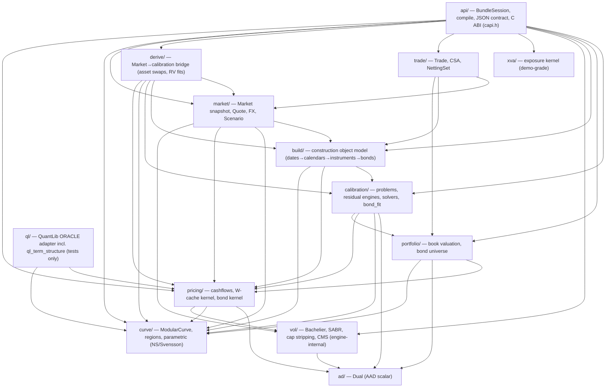
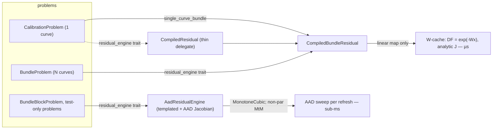

# SwapEngine — code graph

A readable map of the object model for anyone (human or agent) picking the engine up cold. It is the
**map**; `CLAUDE.md` is the **law** (invariants, conventions, phase history).

> **Keep this current.** Any change to the object model — add/remove/rename a type, move a file between
> layers, change a layer dependency, or split/merge a responsibility — updates this file *in the same
> commit*. A stale map is worse than none. (See the rule in `CLAUDE.md`.)
> Last verified against the tree at commit: run `git log -1 --format=%h -- ARCHITECTURE.md`.

## Layers (compile-time dependency DAG)

Every arrow is "depends on / includes". It is acyclic — lower layers never see higher ones. This is what
lets the calibration layer reuse the pricing kernel while the pricing kernel stays QuantLib-free and
standalone.

`tools/check_include_graph.py` reads THIS block and checks it against the real `#include "swaps/<layer>/…"`
edges of `include/` and `api/`: an undeclared edge or a cycle fails the gate (`tools/verify.sh`). So the
diagram is the contract, not a picture of one. The second group of arrows above was added on 2026-09-10 when
the checker first ran — twelve real, legitimate downward edges the diagram had simply never listed. It also
found the two cycles E6.4 then broke: `build ↔ calibration` (the inflation/CDS row TYPES moved from `build/`
to `calibration/`, their builders staying in `build/`) and `calibration ↔ portfolio` (`CurveHandle` and the
rest of the curve-ACCESS family moved from `calibration/bundle_problem.hpp` to `pricing/curve_handle.hpp`,
re-exported into `calibration` so every `cal::CurveHandle` spelling still resolves).

**Production reach of the Tier-1 domains.** `trade/` ships through `book_from_json` (typed `"trades"`
rows + the `"curve_roles"` index→role binding; the CSA picks the discount role); `derive/` + `market/`
ship through the RV verbs (`api/rv.cpp`: `bond_universe`, `govvie_fit`, `swap_spread`). The `exposure` verb now
aggregates per `NettingSet`/CSA (collateral-OIS discounting). **`market::Scenario`/`Market::clone` forks now
reach production through the `scenario` verb** (`api/scenario.cpp`); the Tier-2 analytics layer also ships `pnl`
(carry/roll/market P&L explain) and `vega` (swaption vol-param ladder). Still engine-only (no verb yet):
trade objects. `vol/` and `xva/` are engine-internal
(reached through `api/options.cpp` / `api/exposure.cpp` only).

## The three contracts (what keeps the model coherent)

1. **A curve is anything with `Scalar discount(double t)`.** ModularCurve (free-knot spline regions),
   the parametric Nelson-Siegel/Svensson families, and the bundle's `CurveHandle` all satisfy it; every
   pricing kernel is templated on it. This is why new curve families drop in without kernel changes.
2. **There is ONE generic instrument** (`calibration::Instrument` = `QuoteKind` + legs). New products are
   data (legs + a quote transform) or compositions (`Portfolio`), never new types. The quote RHS lands
   via ONE hand-off — `Instrument::set_target` fed by `market::CalibrationTarget` (from `market::Quote`
   or the API compiler's wire quote) — so band semantics are defined once, in `problem.hpp`.
3. **Risk is one bucket per residual row** (`d(NPV)/dq = d(NPV)/dx · J⁻¹`). Your calibration instruments
   ARE your risk axes; a quantity gets its own bucket by being its own row (this is why the asset-swap
   basis is a pin row + a spread row over a live factor, not a baked target).

## What lives in each layer

| Layer | Key types | Role |
|-------|-----------|------|
| `ad/` | `Dual`, `DualPooled<MaxW>`, `DualDir` | Forward-mode AAD scalar (Eigen `AutoDiffScalar`). The engine is templated on `Scalar` so `double` drives the solve and `Dual` yields the analytic Jacobian from the *same* code; the pooled width keeps a narrow Jacobian heap-free and the width-1 directional dual gives PV01 in one pass. (The reverse-mode tape `Rev<T>` and the forward-over-reverse curve gamma moved to `tests/research/` in E6.1, 2026-09-10 — correct and tested, no production consumer.) |
| `curve/` | **`ModularCurve<S>`** (THE curve), `CurveModule{knots,scheme,sigma}`, `Scheme`, region policies (`Flat/Linear/NaturalCubic/Hermite/MonotoneCubic/BSpline/Tension` + `Boundary`), named layouts `flat_hermite`/`flat_bspline`/`flat_monotone`/`flat_tension`, `CurveTermStructure` (QL adapter) | One forward curve = an **ordered list of interpolation regions**, generic building blocks with **no front/back concept**: every scheme composes in ANY order and ANY position (`region_combinatorial_test.cpp` drives 7 singles + 49 ordered pairs + 343 triples off `ALL_SCHEMES[]`, asserting C0 log-discount continuity at every join). A "flavour" is a **module list**, not a type. `Boundary::has_predecessor` marks region 0 as LEADING — it FLAT-EXTRAPOLATES its first free knot (`forward(t<t1)=v1`, symmetric with the far-end flat extrapolation) instead of pinning `f(0)=0`; a leading BSpline ties its clamp start `cp_[0]` to the first FREE control point. Following regions C0-join their predecessor and are byte-identical to before. `is_linear_map()` (AND over regions) gates the W-cache fast path: linear schemes ride `DF=exp(-Wx)`; the value-dependent `MonotoneCubic` (Hyman filter) is `is_linear_map=false` and routes to the AAD tier. `Tension` (spline under tension, fixed hyperparameter σ in `CurveModule::sigma`) is a **linear** hyperbolic scheme — σ→0 == NaturalCubic, large σ → taut/linear, all sinh/cosh + tridiagonal work in `build()` — so it rides the W-cache like the other linear regions. |
| `pricing/` | **`CurveHandle`/`OutrightHandle`/`SpreadHandle`/`TurnedCurve` + `build_bundle_curves`/`BundleCurveSet`** (`curve_handle.hpp` — type-erased curve ACCESS over a `CurveStructure`; moved out of `calibration/` in E6.4, 2026-09-10, and re-exported there); `RateObservation`, `FloatCoupon`, `FixedCoupon` (generic cashflows); **`Bond`/`BondCashflow`** (curve-space) + **`YieldBond`/`YieldFlow`** + **`YieldConvention`/`StubDiscount`** (street-space) + the bond kernel (`bond.hpp`: `bond_dirty_price`/`bond_z_spread`, `bond_yield_from_clean`/`bond_risk`); **`CurveStructure`** (per-curve topology, `curve_spec.hpp`) + **`Turn`**/`turn_overlap` (localized overnight-forward jumps as an overlay); `integral_weight_matrix` + `forward_weight_matrix` + `bspline_collocation` (W primitives); `CompiledCurveSet` (+ `forward_rows`: the forward analogue of W, spread ancestry + turn indicators), `BundleFloatBatch` (incl. the compiled **MOMENT path**: an arithmetic-average window = one log bracket + a precomputed per-coupon quadratic form ½·step·xᵀQx (+ cubic), `set_state(x)` per tick, x-space Jacobian terms added after the W product — a daily-averaged Fed funds leg at SOFR-leg cost; ~5e-9 documented approximation of the daily sum, which stays available), `BundleFixedLegs` (`compiled_book.hpp`); shared reciprocals `INV = 1/DF` per DF evaluation | QuantLib-free pricing kernel. `DF = exp(-W·x)` once, then cheap per-quote transforms. The columnar (SoA) hot loop. A bond is DATA (dated cashflows + a small `YieldConvention`), priced two ways: curve space (Σ amount·DF, LINEAR in DF → rides the W-cache) and street/yield space (chained `(1+y/f)^{−fτ}`, penny-perfect vs QuantLib). TIMING conventions are absorbed into the per-flow exponent `E_i` at build time (that is what keeps the sweep on the Horner fast path); the one thing an exponent cannot express — the DISCOUNT FORM of the fractional first period — is `YieldConvention{freq, stub, final_period_simple}`: compound stub (gilt/OAT), compound-then-simple-in-the-final-period (US street, Bund), or simple stub (31 CFR App B / Bloomberg Treasury method). Oracles: QuantLib `Compounded` and `SimpleThenCompounded` respectively. |
| `calibration/` | **`Instrument`** (+ `WeightedInstrument` for Portfolio components) + `FloatLeg`/`FixedLeg`/`QuoteKind` (the generic instrument model, incl. `TurnJump` state-pin and `ZeroCouponRate` — the annually-compounded transform `(1+τq)^{1/τ}−1` of the ParRate quotient for one-period exponential swaps such as BRL DI×Pre, W-cacheable via a chain-rule row scale applied before the band), `band_residual` (Huber bid/offer soft target), `CalibrationProblem` (1 curve), **`BundleProblem`** (N curves) + `BundleCurveSpec` (= `pricing::CurveStructure`) + `CurveHandle`/`OutrightHandle`/`SpreadHandle`/**`TurnedCurve`**, `CompiledBundleResidual` (+ `CompiledResidual` delegate), `AadResidualEngine` + `residual_engine` trait (+ `AadBlock` width-reduced FX/MtM AAD on POOLED duals, allocation-free; `kRankThreshold` shared with streaming), `calibrate`/`CalibrationResult` (LM), `StreamingCalibrator` (the warm/streamed tick), `risk`, `GovvieBondFit`/`ParametricBondFit<Model>` (min-pricing-error bond-universe fits), `RegularizedEngine` (any engine + a constant R block) with `second_difference_operator` / `tension_energy_operator` (Tikhonov smoothness: discrete curvature or continuous tension energy ∫(f″)²+σ²∫(f′)²), `pnl_explain` (carry/roll/market decomposition), `BundleBlockProblem` | Turns market quotes into knot forwards. Two tiers — see below. |
| `portfolio/` | `Portfolio` → `CompiledPortfolio`; **`MultiCurveBook`** + **`CompiledMultiCurveBook`** (its W-cache twin — the whole book as one matvec + exp + gathered reduce, ~29× the templated path; Xccy/compounded/non-linear rows fall back to the templated split); **`BondUniverse`** (yield-space batched Newton price↔yield/duration/convexity) + **`CompiledBondBook`** (curve-space W-cache bond reprice + z-spread) | Book valuation off a calibrated curve: data → W-cache → threaded slices (each escalation adds a capability). `MultiCurveBook` is the multi-curve + xccy reprice kernel behind `BundleSession::price_portfolio`: a position FORECASTS one bundle curve and DISCOUNTS another (payer-of-fixed NPV = `float_leg_pv(fwd,disc) − fixed_rate·annuity(disc)`), an xccy position resets its foreign funding-leg notional off the bundle's xccy curve + FX spot (`xccy_mtm_leg_pv`). Templated on `Scalar` like the single-curve `Portfolio`, so `double` prices and `Dual` yields the PV01 gradient in one pass — reusing the SAME `cashflows.hpp` primitives the ParRate/XccyMtmBasis residuals use. |
| `api/` | `BundleSession`, `run_json`, **`compile_spec`/`compile_to_json`** (the `compile` verb, `api/compile.cpp`), `bundle_from_json`/`bundle_to_json`, `book_from_json`, `flat_x0`, `capi.h` (`swaps_run_json`) | The public seam: a JSON object-graph contract + a stateful session, plus a pure-C `extern "C"` entry point (`api/swaps_capi.cpp`) so a non-C++ host (Excel XLL / .NET / ctypes) drives the whole engine through one string-in/string-out call. **The `compile` verb** (`{"compile": spec}`) is the C++ analog of the web's `server/compile.py`: it aggregates the `build/` object model into a resolved `BundleProblem` + streaming config, so a client composes a bundle from typed rows (curves + generic instrument rows + interpolation regions) instead of pasting resolved JSON. `tests/compile_parity_test.cpp` pins its output to `compile.py` to ~1e-9 on every instrument type (both curve layouts, turns, bands, portfolio, multi-curve + xccy). QuantLib-free — this is what the web binding wraps. Carries turns end-to-end: a curve's `"turns":[{start,end}]` overlay and the `"TurnJump"` instrument (`turn_curve`/`turn_index` + band); `flat_x0` seeds each δ at 0. `price_portfolio(MultiCurveBook)` reprices a book off the calibrated `x` and returns `{npv, pv01, price_us, n}` — `price_us` is a steady_clock stamp around the pure double NPV pass ONLY (the pricing analogue of `last_solve_us`; getter `last_price_us()`), `pv01` is d(NPV) for a +1bp parallel knot shift from one AAD pass. For the STREAMING regime (a live book repriced every tick against the recalibrating curve) **`bind_portfolio(book)` + `reprice_bound()`** cache the `CompiledMultiCurveBook` W-cache twin ONCE and reuse it per tick — amortizing the W build across ticks for ~**300×** the per-tick `price_portfolio` (18.05ms → 59.8µs on the 8-curve/200-swap fixture) with an analytic allocation-free +1bp PV01 on the compiled half; the one-shot `price_portfolio` is left byte-identical (building W never pays on a single reprice). Parity-gated to the templated path (`tests/portfolio_compiled_test.cpp`: npv 1e-9, pv01 1e-8, across rebind x-moves + mixed-Xccy fallback). Exposed to the binding as `Session.bind_portfolio`/`reprice_bound` (and the SDK's `Model.bind_book`/`reprice`). **Risk transform**: `price_portfolio_risk(book, reg)` returns the delta ladder dP/dq regularised by `reg` (curvature/tension smoothing that damps the ladder's fan-out into a local key-rate hedge, DV01 preserved — R annihilates level shifts); `cross_jacobian(source)` AAD-prices another bundle's instruments on THIS curve (`dq_source/dx_this`) and `transform_matrix(source, reg)` = `cross_jacobian · risk_operator(reg)` remaps a ladder between bundles with different knot layouts (the "adaptor Jacobian" — no bumping). `run_json` exposes these as the `portfolio` / `portfolio_risk` / `transform` request keys. **Options** (`api/options.cpp`, `vol/`): `price_vol_cube(VolCubeSpec)` (native; `price_vol_cube_json` is the thin JSON wrapper for the seam) reprices a whole swaption expiry×tenor×strike surface off the calibrated `x` — one `sample()` over the union of schedule times gives each cell's forward/annuity, then a pure Bachelier/SABR pass fills a flat SoA `VolCube` (`{cell_forward, cell_annuity, cell_expiry_years, point_cell, strike, moneyness_bp, normal_vol, price, vega, delta, gamma, payer, price_us, n_cells, n_points}`, strikes as absolute / moneyness-bp / ATM). It reuses the calibrated/streaming session, so a live vol surface reprices with NO recalibration (the options analogue of `price_portfolio`; `run_json` key `vol_cube`, pybind `Session.price_vol_cube`, engine-stamped `price_us`). For a FIXED cell set repriced every tick, **`api::VolSurface`** compiles it — schedules resolved + pre-indexed once, SoA pre-sized — so `reprice()` is a pure Bachelier/SABR pass into reused buffers (**~2.3µs, ~4.5× faster than QuantLib's native loop; ~1400× over its idiomatic `Swaption`+engine path**). Gated by `tests/vol_cube_test.cpp` (ATM closed form / put-call parity / SABR ν=0 flat) + `bench/vol_cube_bench.cpp` (warm reprice vs cold). The older per-trade `swaption` verb stays for one-off pricing. **Tier-2 analytics verbs** (each hand-dispatched like `exposure`, each reusing the pricing/risk kernels — no new pricing path): **`scenario`** (`api/scenario.cpp`) wires `market::Scenario` into production — the base bundle is calibrated once, each scenario is a fork (parent unmutated) carrying per-curve/parallel bp shifts + FX bumps, and returns shocked curve samples + book NPV deltas (`npv_delta ≈ PV01·shift`); **`pnl`** (`api/pnl.cpp` → `calibration/pnl_explain.hpp`) is the desk carry/roll/market P&L decomposition between two calibrated states — carry = financing accretion (numeraire rebased to t1 via `RebasedHandle`, DF ratios invariant), roll = curve slide over fixed time, market = ladder·dq, residual = the 2nd-order remainder, with `carry+roll+market+residual == total` to machine precision (the gated SUM contract); **`vega`** (`api/vega.cpp` → `vol/vega_ladder.hpp`) is the vol analogue of the delta ladder — a swaption book's bucketed sensitivity to each surface cell's normal vol / SABR {α,ρ,ν} (Bachelier vega analytic, SABR param sens via tight FD of implied vol; analytic-vs-FD parity 1e-7). Gated by `tests/{scenario_verb,pnl_explain,vega_ladder}_test.cpp`. |
| `build/` | `Date` (`<chrono>` serial) + `calendar` (holiday RULES from the conventions DB — fixed/nth-weekday/last-weekday/easter-offset/weekday-before/vernal- & autumnal-equinox/working-day (China's working weekends) + chained observance policies (two-pass: weekday holidays placed first), SIFMA's first-Friday Good Friday exception, Japan's sandwich rule, calendar JOINs; interpreted, not branched; Easter computus is the one algorithm; every calendar verified DAY BY DAY against QuantLib in `calendar_ql_oracle_test`, tabulated markets regenerated from QuantLib by `tools/ql_calendars_dump` + `tools/calendars_from_ql.py`) + `day_count` + `schedule` (`resolve` token→date, IMM, `curve_time` ACT/365F, `swap_periods_to`); `conventions` (`SwapConv`/`XccyConv`/**`BondConv`** from the generated `conventions_data.hpp`); `observations` (averaged/compounded OIS windows); `instruments` (`ois_coupon`/`float_leg`/`fixed_coupons` + `par_swap`/`basis_swap`/`xccy_mtm_basis`/`fx_forward`/`turn_jump`/`rate_instrument`); `bond` (`fixed_rate_bond`/`us_treasury`/`us_treasury_tsy`/`when_issued_bond`/`us_treasury_wi`/`us_treasury_wi_tsy` → `pricing::Bond` + `pricing::YieldBond`; **`BondId`** (the ONE canonical bond identity: convention-keyed, when-issued-capable) + `build_bond(BondId, vd, settle)`; `par_asset_swap.hpp` (`par_asset_swap_spread`, the endogenous par-par ASW analytic); `yield_convention`/`bond_from_convention`/`wi_bond_from_convention` resolve a convention id ("US-TREASURY", "US-TREASURY-TSY") out of the conventions DB, so a bond TYPE is DATA; the named builders are the only hand-written convention; ACT/ACT ISDA/ICMA in `day_count`) | The QuantLib-free **construction object model** — QuantLib's abstractions (calendars, indices, cashflows, rate-helpers) reproduced so a client can "build up from nothing", but whose OUTPUT is the engine's own flat structs (`RateObservation`/`FloatCoupon`/`Instrument`). Header-only, JSON-free, a faithful transcription of the web's `server/{dates,calendars,conventions,compile}.py`. It only PRODUCES the structs the calc engine consumes — the frozen boundary (`curve/pricing/calibration/portfolio/ad`) is never touched. Golden-tested against the Python source (`build_calendar_test`, `build_instruments_test`). |
| `vol/` | `bachelier`, `sabr` (+ calibration), `swaption`, `fx_black`, `fx_vol_surface` (cap stripping, the no-arb cube interpolator and CMS were deleted in E6.1, 2026-09-10: no consumer) | Vol/options kernels, engine-internal — reached only through `api/options.cpp` (the `swaption`/`vol_cube`/`sabr_calibrate` verbs + `VolSurface`). |
| `xva/` | `exposure.hpp` (npv-grid exposure profile) | Demo-grade exposure kernel behind the `exposure` verb (Gaussian proxy, whole-book netting set — a real XVA model is Tier-3). |
| `market/` | **`Market`** (named curves + FX + quotes + currencies + fixings + **named vol surfaces** + as-of; `clone()` fork), `Quote`/`CalibrationTarget` (the ONE quote→instrument hand-off, consumed by `Instrument::set_target`), `Currency`, `FxMatrix` (USD-pivot triangulation), `Scenario` (declarative shock → `apply(Market)` fork), `FixingSeries`, `VolSurface`/`VolCell` (curve-independent per-cell vol model reusing `vol::SabrParams`) | The Tier-1 market-environment snapshot (Strata's RatesProvider / ORE's TodaysMarket, in our object model). Reaches production through the RV verbs (`govvie_fit`/`swap_spread` build a Market from the request) and the `scenario` verb (`market::Scenario` forks). The **named vol-surface store** (`add_vol_surface`/`vol_surface(name)`, the vol analogue of the named-curve store, carried independently by `clone()` so a Scenario fork's vol is fork-safe) is the vol-as-a-market-object foundation — distinct from the compiled `api::VolSurface`; its consumer (vega/scenario reading ONE shared surface) awaits a stateful-Market design. |
| `trade/` | `Trade` (the booked deal; `to_position` → `MultiCurveBook::Position` via the SAME `build::` leg builders as calibration), `CSA` (collateral → discount index), `NettingSet` | The Tier-1 trade/book domain split from the calibration Instrument. Reaches production through `book_from_json` typed trades: each trade rolls under ITS OWN index's conventions, `"curve_roles"` is the C++ index→role binding, and the CSA decides the discount role (`NettingSet::to_book(vd, csa_role)`). NettingSet exposure aggregation still engine-only (the `trade::Book` tree was deleted in E6.1, 2026-09-10: no consumer). |
| `derive/` | `AssetSwapConvention` (+ `SwapSpreadType`), `benchmark_yield` (Market clean price → street YTM precompute), `derive_asset_swap` (→ the `{pin, asw}` basis rows), `load_universe`, `make_govvie_fit` / `make_parametric_fit<Model>` (minimum-pricing-error RV fits over `build::BondId` universes) | The Market→calibration bridge: per-currency conventions + a market snapshot become calibration rows and RV fits. Consumes `build::BondId` (the ONE bond identity) and `calibration::{GovvieBondFit, ParametricBondFit}`. Reaches production through `api/rv.cpp` — `govvie_fit` (min-pricing-error spline/NS/Svensson + z-spread RV ladder) and `swap_spread` (the headline derivation → the `{pin, asw}` basis rows); the older `asset_swap` verb keeps the endogenous par-par form (`build/par_asset_swap.hpp`). |
| `ql/` | `extract.hpp` (QL → plain data), `ql_term_structure.hpp` (`CurveTermStructure`) | The **only** QuantLib-touching code. Used to bake reference markets and as the oracle in tests — never on the deployed path. |

## The two calibration tiers

Every problem exposes the same interface (`residuals` / `jacobian` / `model_rates` / `n_residuals`); the
`residual_engine<Problem>` trait picks the implementation at compile time.

- **Compiled / W-cache tier** — the microsecond fast path. Requires a linear-map curve (`is_linear_map()`)
  and no curve-dependent notionals. `CompiledResidual` is **not** a second kernel: it wraps the single
  curve as a 1-curve bundle (`single_curve_bundle`) and runs `CompiledBundleResidual`.
- **Hybrid tier** — `residual_engine_t<BundleProblem>` = `HybridBundleResidual`: cacheable rows on the
  W-cache **plus** an `AadBlock` for any non-cacheable rows (a NON-par MtM funding leg, or a portfolio
  containing an FX/MtM leaf), so one exotic trade no longer drops the whole book to AAD. (Standalone FX
  forwards AND MtM-xccy bases with a par funding leg are now on the W-cache — see `FxForward`/`XccyMtmBasis`
  below — so only a non-par MtM funding leg and MonotoneCubic still need the AAD tier. A standard FX+MtM
  cross-currency book is now FULLY W-cacheable: the AAD block is empty, ~13µs/tick vs ~130µs before.) The AAD block seeds only the knots those
  instruments **touch** (`AutoDiffScalar<VectorXd>` is dynamic-width, so this shrinks every gradient), and
  reuses its seed/buffers across ticks. It also holds **`BundleCurveSet`** objects (reusable `double` +
  `Dual` curves): the curve topology is fixed tick to tick, so the handles are built once and their knot
  forwards are overwritten IN PLACE each pass (`CurveHandle::set_forwards`) instead of reconstructing the
  objects — no per-tick handle/curve allocation. When nothing is non-cacheable it is a zero-overhead
  delegate to `CompiledBundleResidual`. Pinned == full-AAD in `multicurrency_test.cpp`.
  A mixed FX/MtM bundle also **streams frozen-Newton** now (it no longer recalibrates each tick): the
  block exposes `residuals_vs_into`/`jacobian_vs_into` against the live market, so `StreamingCalibrator`
  drives the same hybrid engine. Each tick reprices the cacheable rows on the W-cache and the FX/MtM rows
  as cheap doubles; the block's width-reduced AAD Jacobian is recomputed **only on a staleness refresh**,
  not every tick — so on a smooth feed an FX bundle streams with zero AAD sweeps (measured: 0 refreshes,
  reprice to machine precision, `XccyFx.HybridStreamingEqualsRecalibrate`). The FX residual carries the
  live market *inside* its log-basis, so the streamer threads `q` through `instrument_residual(ins, C, q)`
  (a market-override overload of the single residual definition — no forked residual code).
- **AAD tier** — the fully-generic fallback for a bundle with **no `W` at all** — a value-dependent
  scheme (`MonotoneCubic`) — plus the staged `BundleBlockProblem` and test-only problems.

`StreamingCalibrator` is written against the interface, so it drives either tier
unchanged.

### Quote kinds worth calling out

- **`Portfolio`** — a linear combination `Σ weight·quote(component)` of nested `Instrument`s (a swap
  butterfly/condor as ONE residual, no leg outrights). It is **W-cacheable when its components are**: the
  components register as extra batch entries whose weighted quotes ACCUMULATE onto the portfolio's single
  row (`q_rows_/r_rows_` carry a (row, weight) pair; `register_at` recurses so nested portfolios flatten).
  So a swap butterfly stays on the compiled path and streams frozen-Newton at µs. Only a genuinely
  non-cacheable LEAF (a non-par MtM funding leg, here or nested) forces that instrument to the AAD tier.
- **`FxForward`** — a standalone FX forward is **W-cacheable**. `F = fx_spot·DF_num(T)/DF_den(T)`, so the
  residual `(ln F − ln q)/T` is AFFINE in x (`ln DF = −Wx`): `CompiledBundleResidual` registers the two
  DFs, emits `F` in `model_rates`, applies the log-basis in `residuals_vs`, and scatters a two-entry
  `dr/dDF` (`+1/(DF_num·T)`, `−1/(DF_den·T)`) — the `−(G·diag(DF))·W` matmul then yields the *constant*
  `(W_den−W_num)/T` Jacobian row. So an FX-forward-only cross-currency book streams at pure W-cache µs
  (measured: 3 FX add ~0.1µs). Pinned == AAD in `multicurrency_test.cpp`. (FX INSIDE a portfolio still
  routes to AAD — a Σ of FX log-residuals isn't this transform.)
- **`XccyMtmBasis`** — a MtM cross-currency basis with a **par funding leg** is **W-cacheable**. Its
  funding (mtm) leg value is `Σ N_i·[float_coupon_pv(c_i) + (DF_dc(e_i)−DF_dc(s_i))]`; for a par leg
  (`discount==forecast`, plain OIS coupons paying at period end) each bracket is IDENTICALLY zero
  (`DF(e)·(DF(s)/DF(e)−1) + DF(e) − DF(s) = 0`, value AND derivative), so the FX-reset-notional term
  vanishes and the quote collapses to the ParSpread quotient `(pv_self − pv_fx)/ann`. The reduction is
  guarded by a **numerical** check `mtm_funding_term_negligible(ins, curves)` (bundle_problem.hpp): at
  construction it prices the DROPPED funding term `mtm/(fx_spot·ann)` — value AND gradient — through the
  full templated kernel on the REAL rolled-out cashflows, at two reference curves, and only reduces if
  both are below tol. This is DATA-DRIVEN, not a structural field-match, so a payment lag, averaging
  convexity (`fixing_step>0`), a funding spread or non-native/CSA funding-leg discounting all make the term
  nonzero → the instrument correctly falls back to the AAD engine instead of silently dropping a real
  cashflow. Measured: 8 par MtM add ~1.4µs on the W-cache (was ~52µs on the AAD block). Pinned == AAD, and
  the four practical deviations pinned to reject, in `multicurrency_test.cpp`.
- **Bid/offer band** (`band_lower`/`band_upper`/`band_decay` on any instrument) — a soft target, so a
  value within bid/offer is ~satisfied and the solver spends its freedom on the
  hard targets. The band residual is HUBER-shaped (`problem.hpp band_residual`: `decay`-slope pull to mid
  inside `[lower, upper]`, unit-slope pull to the nearer edge outside, continuous at the edges) — its square
  is convex (one minimum; the earlier smooth Gaussian ramp gave two fits 110 bp apart in a knot) and its
  Jacobian row is `slope·∂q/∂x` with `slope ∈ {decay, 1}`, a per-row scalar (`band_residual_d`), so banded
  rows **stay on the compiled W-cache path for cold calibrate AND µs streaming**. The streamer is
  Gauss-Newton, so it solves the soft least-squares directly: `StreamingCalibrator` drives the banded
  residual `residuals_vs(x, q)` against the live market `q` (not an exact reprice `model_rates−q`), with a
  consistent `jacobian_vs(x, q)`; at the soft minimum `dx = J⁺·r → 0` even though `r ≠ 0`. A band-edge
  crossing is handled by re-scaling that frozen row and re-factorising `M` (no Jacobian recompute,
  `StreamTick::rescales`); a drift-triggered refresh bounds the second-order error on non-square problems.
  Banded bundles are floored to light tension smoothing by both compilers (`has_bands`): the band slack
  otherwise leaves the forwards free along the direction the quotes barely see. The compiled band
  Jacobian is pinned against AAD, streaming-==-recalibrate is pinned, and streamed-==-cold-LS through
  edge crossings is pinned (`tests/streaming_band_test.cpp`), in
  `portfolio_instrument_test.cpp`.

## A calibration, end to end

1. **Build** — a `BundleProblem` of `BundleCurveSpec` curves (each `modules()` → a `ModularCurve` layout)
   + `Instrument`s (legs carry their own forecast/discount curve roles; `QuoteKind` is the transform).
   - **Turns** (`CurveStructure::turns`, `docs/turns-calibration.md`) are an additive overlay, NOT
     interpolation knots: a curve's state block is `[ n_interp_knots interp forwards | one δ per turn ]`,
     so `n_knots() = n_interp_knots() + turns.size()`. Each δ gets a closed-form `turn_overlap` column in
     `W_all` (DF observes it, and spread/dependent curves observe it for free via the base recursion); the
     templated path wraps the built curve in `TurnedCurve`. A `TurnJump` instrument PINS a δ to a banded
     target (a linear state-pin residual, Jacobian a unit column) so it is always identifiable. The δ's sit
     OUTSIDE the interp block, so the curvature regulariser (`n_interp_knots` segments) never penalises them.
2. **Compile** — `residual_engine_t<BundleProblem>` = `CompiledBundleResidual`: `CompiledCurveSet` builds
   the block `W_all`; instruments register into columnar batches (`BundleFloatBatch`/`BundleFixedLegs`).
3. **Solve** — `calibrate()` runs Levenberg–Marquardt: `residuals(x)` = `exp(-W·x)` + per-quote transforms,
   `jacobian(x)` analytic. Under-determined bundles add a Tikhonov smoothness penalty — the discrete
   `second_difference_operator` (curvature) or the continuous `tension_energy_operator` (∫(f″)²+σ²∫(f′)²) —
   as a constant pseudo-residual block composed onto the engine (`RegularizedEngine`), off the AAD path.
4. **Stream** — `start_streaming()` anchors a `StreamingCalibrator`; each `update(q)` re-solves to the exact
   curve via frozen-Newton (µs). Hard, banded, portfolio AND mixed FX/MtM bundles all take this path (FX/MtM
   on the hybrid engine, its AAD Jacobian refreshed only on staleness); only a MonotoneCubic scheme — which
   has no constant W at all — falls back to per-tick `recalibrate()`.
5. **Sample / value** — `BundleSession::sample(times)` reads DFs; `Portfolio` values a book off the curve.

## Test-only scaffolding (not shipped)

Lives in `tests/`, never in `include/`: `spread_reference.hpp` (`swaps::testing::SpreadCurve` +
`SpreadCalibrationProblem` — the fixed-base spread path, used only by `spread_test.cpp`; production spreads
calibrate jointly via `SpreadHandle`), and the `reference_*.hpp` QuantLib market builders. See
`tests/ORACLE_TESTS.md` for the oracle-test policy.

## The gates (what `tools/verify.sh` actually checks — PRINCIPLES.md P9)

| Step | Tool | What fails it |
|---|---|---|
| build | cmake/ninja | QuantLib absent (fatal unless `-DSWAPS_ALLOW_NO_ORACLE=ON`, which marks the build non-gated) |
| oracle/consistency registry | `tools/check_oracle_tests.sh --build` | a registered file missing / wrong banner / oracle without QuantLib / fewer `TEST`s or `EXPECT`s than `tests/oracle_assertions.lock` / a QuantLib-linked binary missing or listing fewer tests than locked. `tools/selftest_guards.sh` proves it trips. |
| test taxonomy | `tools/check_test_taxonomy.sh` | a `tests/*.cpp` without its T1–T6 label (what its assertions compare an engine number TO — `tests/TAXONOMY.md`) |
| include graph | `tools/check_include_graph.py` | a cross-layer `#include` that is not an arrow in the layer DAG above, or a cycle |
| oracle reach | `tools/oracle_coverage.py --check` | a header in `tests/oracle_coverage.lock` is no longer in the include closure of any registered QuantLib oracle (reach may only grow) |
| verb density | `tools/verb_density.py --check` + `--selftest` | an `api/` file carries more behaviour than `tests/verb_density.lock` allows — conventions lookups, invented defaults, loops, floating-point compute or branches, counted from clang's typed AST and cross-checked against the file's tokens (PRINCIPLES.md P14, E7). Counts may only go down. |
| conventions schema | `tools/check_schema.py` | `conventions.json` fails `conventions.schema.json` (swap products must carry calendar/bdc/lags/leg day counts+frequencies; currencies/calendars/bonds declared) or references an id that does not exist |
| conventions sync | `tools/gen_conventions_hpp.py --stdout` diff | `conventions.json` edited without regenerating `conventions_data.hpp` |
| no-literal conventions | `tools/check_no_literals.py` | any NEW currency/index/calendar/day-count/frequency/lag/recovery literal or silent fallback in `include/` or `api/` (existing ones are a ratchet in `tools/check_no_literals.allow`, burned down in E2) |
| api-dispatch sync | `tools/gen_dispatch.py --stdout` diff | descriptor edited without regenerating the dispatch |
| correctness | ctest: `swaps_tests`, `swaps_allocfree_tests`, `swaps_api_tests`, `swaps_oracle_tests` (engine vs QuantLib numbers), `swaps_consistency_tests` (QuantLib-linked self-consistency) | any red test; timing/scheduler assertions run only with `SWAPS_TIMING_ASSERTS=1` (nightly) |
| performance | `tools/check_perf.py` | `ours_ns > 1.25 × baseline` for this fingerprint (`baselines/baselines.json`, key = CPU + ISA + engine arch flag + compiler + **QuantLib toolchain**) or `ours_ns > target` (`baselines/targets.json`, ratchets down only); refuses to run when the CPU is >15% busy (2 s sample). QuantLib numbers are printed as an informational reference, never gated. |

Enforcement: `.githooks/pre-push` (`tools/install_hooks.sh`) runs the guards + `verify.sh --test-only`; `.github/workflows/ci.yml` builds and runs the QuantLib-free binaries on every push; `tools/nightly.sh` (launchd, `tools/install_nightly.sh`) runs the full gate quiesced and writes `baselines/NIGHTLY.md`. Flags have one source of truth, `cmake/DetectISA.cmake`, probed by `tools/archprobe` for `bootstrap_deps.sh` (QuantLib is built with the engine's exact flags) and `fingerprint.sh`.

**One integer date convention**: every integer date the engine stores or accepts is a Unix-day serial (days since 1970-01-01 ==
`build::Date::serial()`): `FixingTable`/`PricingContext`, `FixingSeries`, CB meetings and the builders' `FixingDay` schedules.
`FixingTable::set` and `set_evaluation_date` reject anything outside 1900..2299, so a Python `date.toordinal()` (739xxx) cannot be
stored as a date (until 2026-09-09 the builders emitted ordinals while `FixingSeries` used serials).

## The conventions registry (PRINCIPLES.md P2 — "specifics as data", runtime-extensible)

`conventions/conventions.json` (currencies · calendars · day_counts · indices · products · bonds) is codegen'd to
`include/swaps/conventions_data.hpp` (constexpr `kCurrencies/kCalendars/kHolidayRules/kIndices/kProducts/kBonds`)
which then includes the hand-written **`include/swaps/conventions_db.hpp`**: `swaps::conventions::Registry`, a
process-wide overlay on top of the baked arrays. Lookups `product/index/bond/currency/calendar(id)` return
`std::optional` (overlay first, then baked); `require_*(id)` THROW on a miss — there are no silent fallbacks
anywhere in `build/` or `api/` any more (unknown calendar → USD SIFMA, unknown currency → USD, empty day count →
ACT/360, float-frequency → EURIBOR product guesses all died on 2026-09-09). A curve that names no index resolves
through `currencies[ccy].default_swap_product`; xccy conventions come from `XCCY-MTM-<PAIR>`; weekend-only
synthetic problems name the DB calendar `"NONE"` explicitly. Any API adds or overrides entries at runtime with
the stateless **`conventions`** verb (`{"conventions": {"currencies": {...}, "calendars": {...}, "indices": {...},
"products": {...}, "bonds": {...}}}`, rows in exactly the JSON file's shapes; `clear_overlay` resets) and reads
what the engine knows with **`list_conventions`** (`api/conventions.cpp`; `tests/conventions_registry_test.cpp`).
The DB also carries `credit.cds_products` (recovery / premium schedule / accrual day count / protection steps),
`bond_futures` (deliverable convention, CF notional coupon, maturity rounding, repo day count), `fx_pairs` (spot lag,
calendar, premium currency, delta/ATM conventions), `cb_schedules` (central-bank meeting dates per currency,
sourced + dated), `fixing_sources` (index → provider/series/start/granularity: where realized fixings are FETCHED from;
fetching stays API-side, the metadata lives here so no client keeps its own provider table) and `inflation` (ZCIS reference
indices: observation lag in months + flat|linear interpolation; reported by the verb today, consumed by the kernel in E4.8) — each with its own registry lookup, `require_*`, overlay `add_*` and listing. The verbs consume
them: `credit` needs a `product`, `bond_future` a `contract`, `bonds`/`bond_universe`/`govvie_fit`/`swap_spread`
a bond `convention`, `swaption`/`vol_cube`/`vega` an `index` (currency derived from it), `inflation` a `base` and an `index`; a `zero_coupon` product (DB `products[].zero_coupon`, BRL-CDI-SWAP) makes `par_swap` build the one-period `ZeroCouponRate` instrument — the row decides the shape, no frequencies;
a typed trade needs a `csa` or `discount_index`; `FxMatrix` takes its pivot explicitly. `tools/check_no_literals.py`
(verify.sh) fails on any new convention literal in `include/`+`api/`; of the original 130 ratcheted hits ONE remains
(`schedule.hpp` `resolve()` rolling tenor tokens on weekends only — E2 step 3), the rest are vocabulary-dispatch or
DB-row defaults documented in `tools/check_no_literals.allow`.

> **Performance:** see [`OPTIMIZATION.md`](OPTIMIZATION.md) for how the calibration/streaming path was made fast (the W-cache, hybrid AAD, frozen-Newton streaming, alloc-free/SIMD hot path) and the repeatable optimization playbook.
